# agentapi-proxy アーキテクチャドキュメント

このドキュメントでは、agentapi-proxy のパッケージ構造、インターフェース、依存関係について図示します。

## 目次

- [1. レイヤーアーキテクチャ概要](#1-レイヤーアーキテクチャ概要)
- [2. パッケージ構造](#2-パッケージ構造)
- [3. ドメインエンティティ関係図](#3-ドメインエンティティ関係図)
- [4. インターフェース/ポート依存関係](#4-インターフェースポート依存関係)
- [5. DIコンテナの依存関係](#5-diコンテナの依存関係)
- [6. 主要なフロー図](#6-主要なフロー図)

---

## 1. レイヤーアーキテクチャ概要

agentapi-proxy は **Clean Architecture (クリーンアーキテクチャ)** と **Hexagonal Architecture (ヘキサゴナルアーキテクチャ)** のパターンに基づいて設計されています。

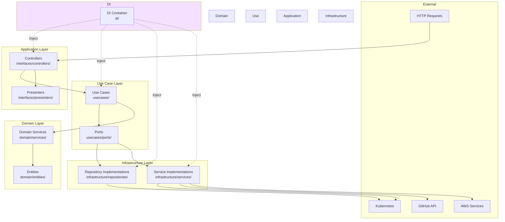

### アーキテクチャの特徴

1. **関心の分離**: 各レイヤーは明確な責務を持つ
2. **依存性の反転**: 上位レイヤーは下位レイヤーに依存しない（インターフェースを通じて依存）
3. **テスタビリティ**: インターフェースによりモックが容易
4. **拡張性**: 新しい実装を追加してもコアロジックは変更不要

---

## 2. パッケージ構造

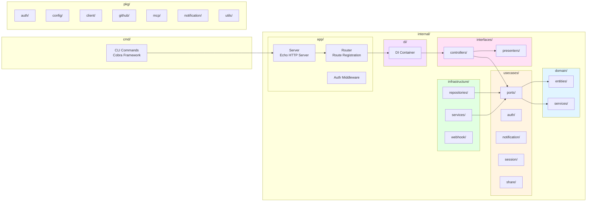

### パッケージの役割

| パッケージ | 役割 |
|-----------|------|
| `cmd/` | CLI エントリーポイント（Cobra コマンド） |
| `internal/app/` | HTTP サーバーとルーティング |
| `internal/di/` | 依存性注入コンテナ |
| `internal/domain/` | ビジネスロジックとエンティティ |
| `internal/usecases/` | ユースケース層とポート定義 |
| `internal/infrastructure/` | インフラ実装（リポジトリ、サービス） |
| `internal/interfaces/` | API コントローラーとプレゼンター |
| `pkg/` | 公開ユーティリティ |

---

## 3. ドメインエンティティ関係図

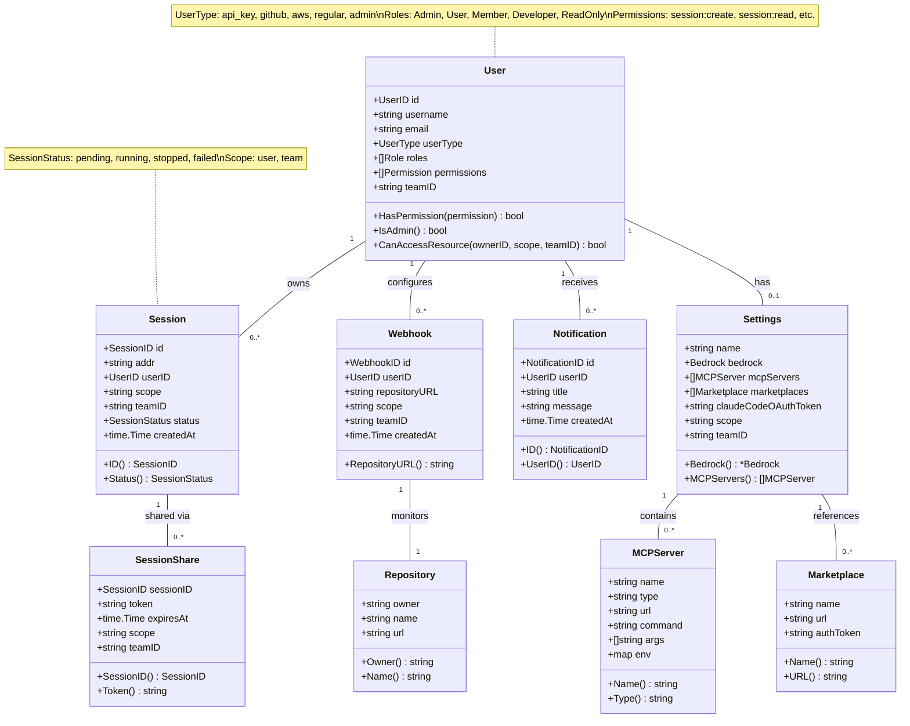

### エンティティの責務

| エンティティ | 責務 |
|-------------|------|
| **User** | ユーザー認証情報、権限管理、リソースアクセス制御 |
| **Session** | agentapi セッションのライフサイクル管理 |
| **Settings** | ユーザー/チーム設定（Bedrock、MCP、Marketplace） |
| **Notification** | プッシュ通知データ |
| **Webhook** | GitHub Webhook 設定 |
| **SessionShare** | セッション共有トークン管理 |
| **MCPServer** | Model Context Protocol サーバー設定 |
| **Marketplace** | プラグインマーケットプレイス設定 |
| **Repository** | Git リポジトリ情報 |

---

## 4. インターフェース/ポート依存関係

### 4.1 リポジトリポート

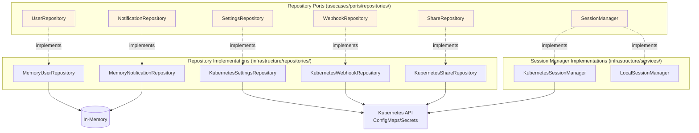

### 4.2 サービスポート

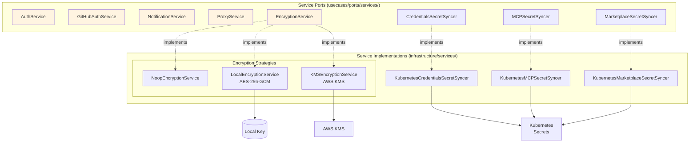

### 4.3 ユースケース層

```mermaid
graph TB
    subgraph "Use Cases (usecases/)"
        AuthenticateUserUC[AuthenticateUserUseCase]
        ValidateAPIKeyUC[ValidateAPIKeyUseCase]
        GitHubAuthUC[GitHubAuthenticateUseCase]
        ValidatePermissionUC[ValidatePermissionUseCase]
        SendNotificationUC[SendNotificationUseCase]
        ManageSubscriptionUC[ManageSubscriptionUseCase]
        SessionUC[SessionUseCase]
        ShareUC[ShareUseCase]
    end

    subgraph "Ports"
        AuthSvc2[AuthService]
        GitHubAuthSvc2[GitHubAuthService]
        NotificationSvc2[NotificationService]
        UserRepo2[UserRepository]
        SessionMgr2[SessionManager]
        NotificationRepo2[NotificationRepository]
        ShareRepo2[ShareRepository]
    end

    AuthenticateUserUC --> AuthSvc2
    AuthenticateUserUC --> UserRepo2
    ValidateAPIKeyUC --> AuthSvc2
    GitHubAuthUC --> GitHubAuthSvc2
    GitHubAuthUC --> UserRepo2
    ValidatePermissionUC --> UserRepo2
    SendNotificationUC --> NotificationSvc2
    SendNotificationUC --> NotificationRepo2
    ManageSubscriptionUC --> NotificationRepo2
    SessionUC --> SessionMgr2
    ShareUC --> ShareRepo2
    ShareUC --> SessionMgr2

    style AuthenticateUserUC fill:#e1f5ff
    style ValidateAPIKeyUC fill:#e1f5ff
    style GitHubAuthUC fill:#e1f5ff
    style ValidatePermissionUC fill:#e1f5ff
    style SendNotificationUC fill:#e1f5ff
    style ManageSubscriptionUC fill:#e1f5ff
    style SessionUC fill:#e1f5ff
    style ShareUC fill:#e1f5ff
```

---

## 5. DIコンテナの依存関係

DI コンテナ (`internal/di/container.go`) はすべての依存関係を管理し、アプリケーション起動時に初期化します。

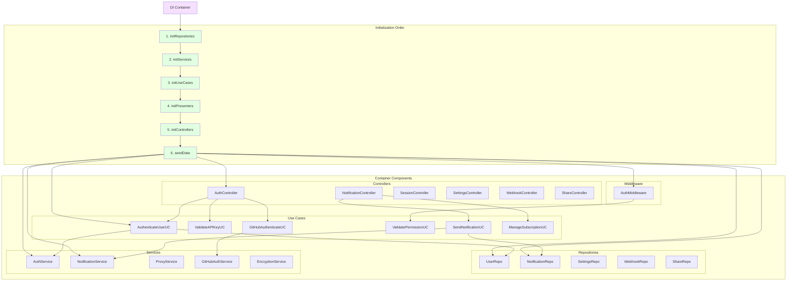

### DI コンテナの責務

1. **依存関係の解決**: すべてのコンポーネントを正しい順序で初期化
2. **ライフサイクル管理**: シングルトンインスタンスの管理
3. **構成の集約**: アプリケーション全体の構成を一箇所で管理
4. **テスト容易性**: テスト時はモックに置き換え可能

---

## 6. 主要なフロー図

### 6.1 セッション作成フロー

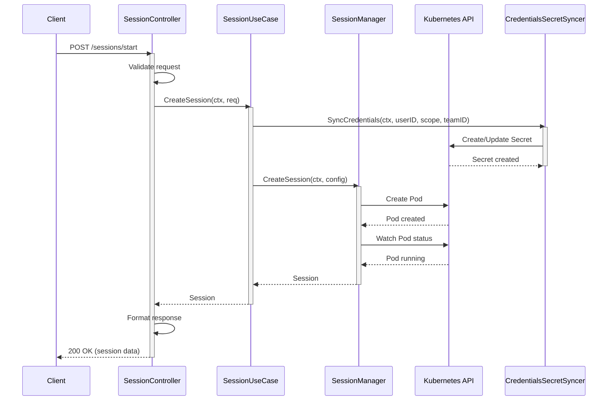

### 6.2 設定更新フロー（暗号化付き）

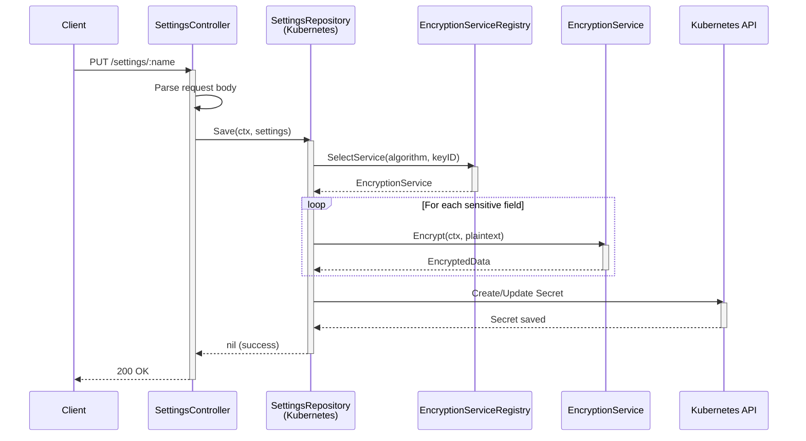

### 6.3 GitHub OAuth 認証フロー

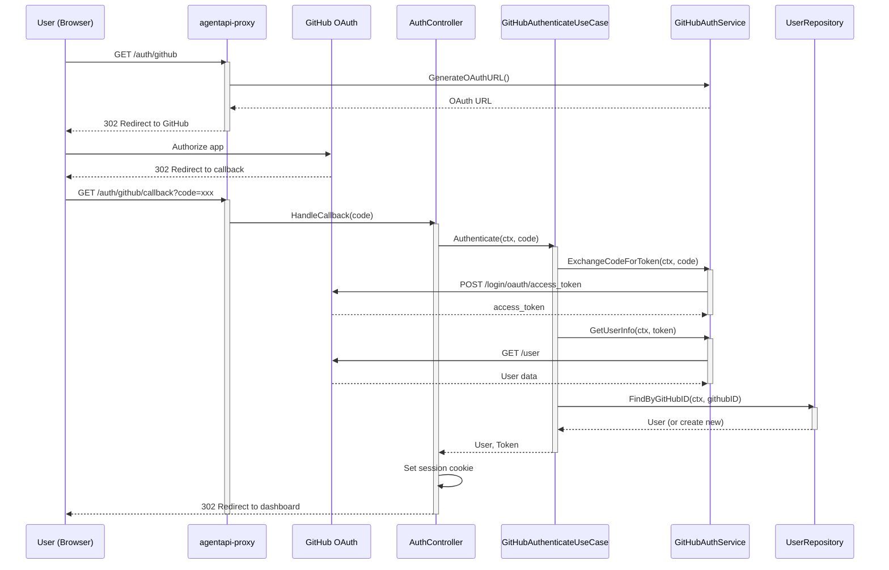

### 6.4 通知送信フロー

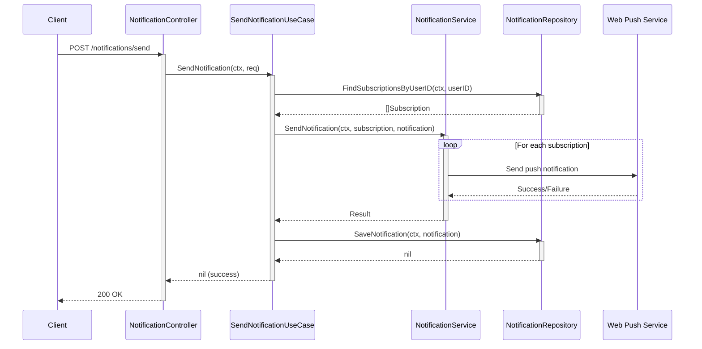

---

## 7. デザインパターン

agentapi-proxy では以下のデザインパターンが採用されています。

### 7.1 採用されているパターン

| パターン | 適用箇所 | 目的 |
|---------|---------|------|
| **Clean Architecture** | 全体構造 | 関心の分離、テスタビリティ |
| **Hexagonal Architecture** | Port & Adapter 層 | ビジネスロジックの独立性 |
| **Dependency Injection** | `internal/di/` | 疎結合、テスト容易性 |
| **Repository Pattern** | `usecases/ports/repositories/` | データアクセスの抽象化 |
| **Service Locator** | `Container` | 依存関係の集中管理 |
| **Strategy Pattern** | Encryption, Credentials | アルゴリズムの切り替え |
| **Factory Pattern** | `EncryptionServiceFactory` | オブジェクト生成の抽象化 |
| **Chain of Responsibility** | `CredentialProviderChain` | 複数プロバイダーの連鎖 |
| **Adapter Pattern** | Infrastructure 層 | 外部サービスの抽象化 |

### 7.2 パターン適用例

#### Strategy Pattern（暗号化サービス）

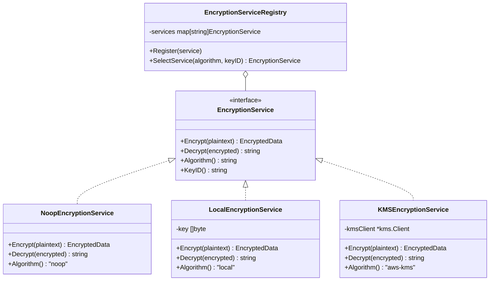

#### Chain of Responsibility（認証情報プロバイダー）

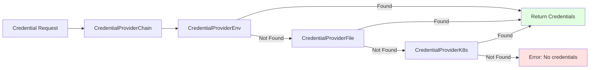

---

## 8. リソーススコープとマルチテナンシー

agentapi-proxy は **ユーザースコープ** と **チームスコープ** の2つのリソーススコープをサポートしています。

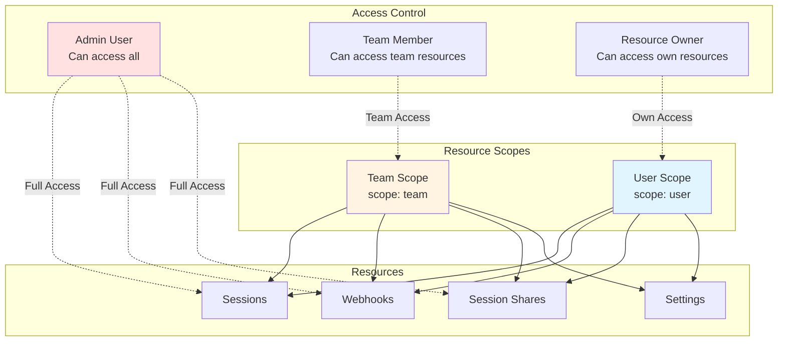

### アクセス制御ロジック

```go
func (u *User) CanAccessResource(ownerUserID UserID, scope string, teamID string) bool {
    // Admin can access all resources
    if u.IsAdmin() {
        return true
    }

    // Team-scoped resources
    if scope == ScopeTeam {
        return u.teamID == teamID
    }

    // User-scoped resources
    return u.id == ownerUserID
}
```

---

## 9. 外部依存関係

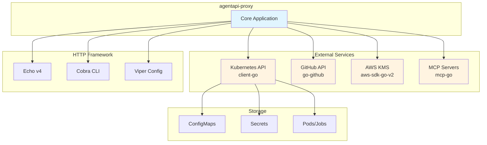

### 主要な外部ライブラリ

| ライブラリ | 用途 | パッケージ |
|-----------|------|-----------|
| Echo v4 | HTTP Web フレームワーク | `github.com/labstack/echo/v4` |
| Cobra | CLI フレームワーク | `github.com/spf13/cobra` |
| Viper | 設定管理 | `github.com/spf13/viper` |
| go-github | GitHub API クライアント | `github.com/google/go-github/v57` |
| client-go | Kubernetes クライアント | `k8s.io/client-go` |
| aws-sdk-go-v2 | AWS SDK | `github.com/aws/aws-sdk-go-v2` |
| mcp-go | Model Context Protocol | `github.com/mark3labs/mcp-go` |

---

## 10. まとめ

### アーキテクチャの強み

1. **明確な責務分離**: 各レイヤーが独立した責務を持つ
2. **高いテスタビリティ**: インターフェースによりモックが容易
3. **拡張性**: 新しい実装を追加してもコアロジックは変更不要
4. **保守性**: 変更の影響範囲が限定される
5. **マルチテナンシー対応**: ユーザーとチームのスコープ管理

### 開発時の注意点

1. **依存の方向**: 常に外側から内側へ（Infrastructure → Use Cases → Domain）
2. **インターフェース優先**: 実装よりもインターフェース定義を先に行う
3. **DI コンテナの活用**: 依存関係は DI コンテナで解決
4. **テストの記述**: 各レイヤーで適切なユニットテストを記述
5. **ドキュメント更新**: アーキテクチャ変更時は本ドキュメントも更新

---

このドキュメントは、agentapi-proxy の全体像を理解するためのガイドです。詳細な実装については、各パッケージのコードとテストを参照してください。
